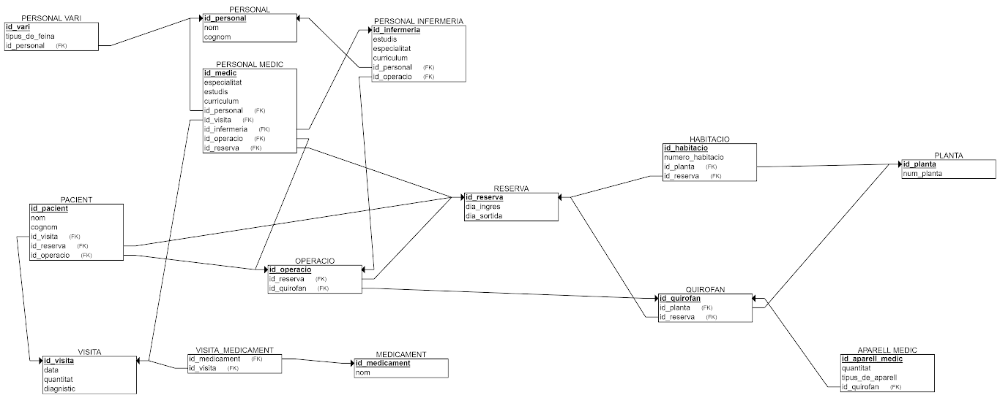

# <p align="center"> ANNEX 1 - MODEL ER </p>

<br>


<br>

# <p align="center"> ANNEX 1 - ESQUEMA RELACIONAL </p>




<br>

# <p align="center"> ANNEX 1 - CREACIO DE TAULES </p>

TAULA PERSONAL
--------------
```
CREATE TABLE PERSONAL (
    id_personal SERIAL PRIMARY KEY,
    nom VARCHAR(25) NOT NULL, 
    cognom VARCHAR(50) NOT NULL
);
```
TAULA PLANTA
------------
```
CREATE TABLE PLANTA(
    id_planta SERIAL PRIMARY KEY, 
    num_plantes INTEGER NOT NULL
);

```
TAULA VISITA
-------------
```
CREATE TABLE VISITA(
    id_visita SERIAL PRIMARY KEY,
    quantitat INT,
    data_hora TIMESTAMP NOT NULL,
    diagnostic VARCHAR (255)
);
```
TAULA RESERVA
--------------------
```
CREATE TABLE RESERVA (
    id_reserva SERIAL PRIMARY KEY, 
    dia_ingres DATE NOT NULL, 
    dia_sortida DATE NOT NULL
);
```
TAULA MEDICAMENT
-------------------------
```
CREATE TABLE MEDICAMENT (
    id_medicament SERIAL PRIMARY KEY, 
    nom VARCHAR(25) NOT NULL
);
```
TAULA QUIROFAN
------------
```
CREATE TABLE QUIROFAN(
    id_quirofan SERIAL PRIMARY KEY, 
    id_reserva INT,
    id_planta INT,
    CONSTRAINT quirofans_planta_fk FOREIGN KEY (id_planta) REFERENCES PLANTA(id_planta),
    CONSTRAINT quirofans_reserva_fk FOREIGN KEY (id_reserva) REFERENCES RESERVA(id_reserva)
);

```
TAULA OPERACIO
--------------
```
CREATE TABLE OPERACIO (
    id_operacio SERIAL PRIMARY KEY,
    id_reserva INT,
    id_quirofan INT,
    CONSTRAINT id_reserva_operacio_operacio_fk  FOREIGN KEY (id_reserva) REFERENCES RESERVA(id_reserva),
    CONSTRAINT id_reserva_quirofan_operacio_fk  FOREIGN KEY (id_quirofan) REFERENCES QUIROFAN(id_quirofan) 
);
```
TAULA PACIENT
----------------------
```
CREATE TABLE PACIENT(
    id_pacient SERIAL PRIMARY KEY, 
    nom VARCHAR(25) NOT NULL, 
    cognom VARCHAR(50) NOT NULL,
    id_visita INT,
    id_reserva INT,
    id_operacio INT,
    CONSTRAINT pacient_visita_fk FOREIGN KEY (id_visita) REFERENCES VISITA (id_visita),
    CONSTRAINT pacient_reserva_fk FOREIGN KEY (id_reserva) REFERENCES RESERVA (id_reserva),
    CONSTRAINT pacient_operacio_fk FOREIGN KEY (id_operacio) REFERENCES OPERACIO (id_operacio)
);
```
TAULA PERSONAL_INFERMERIA
---------------
```
CREATE TABLE PERSONAL_INFERMERIA(
    id_infermeria SERIAL PRIMARY KEY,
    estudis VARCHAR(255),
    especialitat VARCHAR(25) NOT NULL,
    curriculum VARCHAR(255),
    id_personal INT,
    id_operacio INT,
    CONSTRAINT personals_infermeria_fk FOREIGN KEY (id_personal) REFERENCES PERSONAL (id_personal),
    CONSTRAINT operacio_infermeria_fk FOREIGN KEY (id_operacio) REFERENCES OPERACIO (id_operacio)
);
```
TAULA PERSONAL_MEDIC
-----------------------
```
CREATE TABLE PERSONAL_MEDIC(
    id_medic SERIAL PRIMARY KEY,    
    especialitat VARCHAR(25) NOT NULL,
    curriculum VARCHAR(255),
    estudis VARCHAR(255),
    id_personal INT,
    id_visita INT,
    id_infermeria INT,
    id_operacio INT,
    id_reserva INT,
    CONSTRAINT personals_medic_fk FOREIGN KEY (id_personal) REFERENCES PERSONAL (id_personal),
    CONSTRAINT visita_medic_fk FOREIGN KEY (id_visita) REFERENCES VISITA (id_visita),
    CONSTRAINT infermeria_medic_fk FOREIGN KEY (id_infermeria) REFERENCES PERSONAL_INFERMERIA (id_infermeria),
    CONSTRAINT operacio_medic_fk FOREIGN KEY (id_operacio) REFERENCES OPERACIO (id_operacio),
    CONSTRAINT reserva_medic_fk FOREIGN KEY (id_reserva) REFERENCES RESERVA (id_reserva)
);
```
TAULA HABITACIO
-------------------
```
CREATE TABLE HABITACIO(
    id_habitacio SERIAL PRIMARY KEY, 
    num_habitacio INTEGER NOT NULL,
    id_planta INT, 
    id_reserva INT,
    CONSTRAINT planta_habitacio_fk FOREIGN KEY (id_planta) REFERENCES PLANTA (id_planta),
    CONSTRAINT habitacio_reserva_fk FOREIGN KEY (id_reserva) REFERENCES RESERVA(id_reserva)
);
```
TAULA PERSONAL_VARI
-------------------
```
CREATE TABLE PERSONAL_VARI(
    id_vari SERIAL PRIMARY KEY, 
    tipus_de_feina VARCHAR(25) NOT NULL,
    id_personal INT,
    CONSTRAINT personals_vari_fk FOREIGN KEY (id_personal) REFERENCES PERSONAL (id_personal)
);

```
TAULA APARELL_MEDIC
----------------
```
CREATE TABLE APARELL_MEDIC(
    id_aparell_medic SERIAL PRIMARY KEY,  
    tipus_de_aparell VARCHAR(25) NOT NULL,
    quantitat INT,
    id_quirofan INT,
    CONSTRAINT aparell_medic_quirofan_fk FOREIGN KEY (id_quirofan) REFERENCES QUIROFAN(id_quirofan)
);

```
TAULA VISITA_MEDICAMENT
-----------------------
```
CREATE TABLE VISITA_MEDICAMENT (
    id_visita INT,
    id_medicament INT, 
    CONSTRAINT id_visita_fk  FOREIGN KEY (id_visita) REFERENCES VISITA(id_visita),
    CONSTRAINT id_medicament_fk FOREIGN KEY (id_medicament) REFERENCES MEDICAMENT(id_medicament)
);
```
<br>

# Readme
#### [Readme](https://github.com/miguelIH/Projecte-Intermodular/blob/main/Readme.md)
#### [Annex_2_Connectivitat_i_login](https://github.com/miguelIH/Projecte-Intermodular/tree/main/Annex_2_Connectivitat_i_login)
#### [Annex_3_Bloc_de_manteniment](https://github.com/miguelIH/Projecte-Intermodular/tree/main/Annex_3_Bloc_de_manteniment)
#### [Annex_4_Bloc_de_consultes_i_informess](https://github.com/miguelIH/Projecte-Intermodular/tree/main/Annex_4_Bloc_de_consultes_i_informes)
#### [Annex_5_Bloc_de_exportacio_de_dades](https://github.com/miguelIH/Projecte-Intermodular/tree/main/Annex_5_Bloc_de_exportacio_de_dades)
#### [Annex_6_API_Seguretat_Social](https://github.com/miguelIH/Projecte-Intermodular/tree/main/Annex_6_API_Seguretat_Social)
