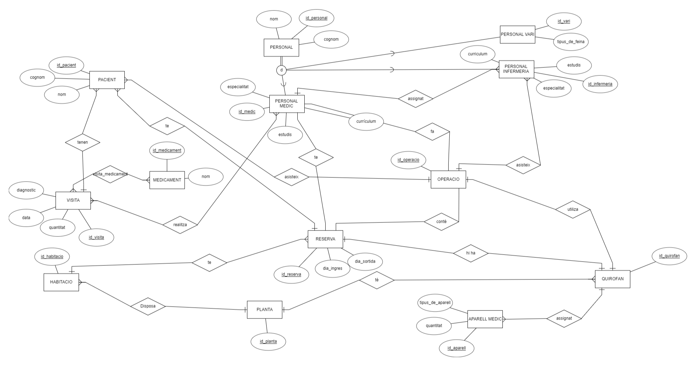

# <p align="center"> ANNEX 1 - MODEL ER </p>

<br>



<br>

# <p align="center"> ANNEX 1 - ESQUEMA RELACIONAL </p>


<br>

# <p align="center"> ANNEX 1 - CREACIO DE TAULES </p>

TAULA PERSONAL
--------------
```
CREATE TABLE PERSONAL (
    id_personal SERIAL PRIMARY KEY,
    nom VARCHAR(255) NOT NULL, 
    cognom VARCHAR(255) NOT NULL
);
```
TAULA PLANTA
------------
```
CREATE TABLE PLANTA(
    id_planta SERIAL PRIMARY KEY, 
    num_plantes INTEGER NOT NULL
);

```
TAULA PACIENT
-------------
```
CREATE TABLE PACIENT(
    id_pacient SERIAL PRIMARY KEY, 
    nom VARCHAR(255) NOT NULL, 
    cognom VARCHAR(255) NOT NULL
);
```
TAULA PERSONAL_MEDIC
--------------------
```
CREATE TABLE PERSONAL_MEDIC(
    id_personal_medic SERIAL PRIMARY KEY,    
    especialitat VARCHAR(255) NOT NULL,
    id_personal INT,
    CONSTRAINT personals_medic_fk FOREIGN KEY (id_personal) REFERENCES PERSONAL (id_personal)
);
```
TAULA PERSONAL_INFERMERIA
-------------------------
```
CREATE TABLE PERSONAL_INFERMERIA(
    id_personal_infermeria SERIAL PRIMARY KEY, 
    id_personal INT,
    CONSTRAINT personals_infermeria_fk FOREIGN KEY (id_personal) REFERENCES PERSONAL (id_personal)
);
```
TAULA VISITA
------------
```
CREATE TABLE VISITA(
    id_visita SERIAL PRIMARY KEY,
    diagnostic VARCHAR(255) NOT NULL, 
    data_hora_visita TIMESTAMP NOT NULL, -
    id_personal_medic INT,
    id_pacient INT,
    CONSTRAINT personal_fk FOREIGN KEY (id_personal_medic) REFERENCES PERSONAL_MEDIC(id_personal_medic), 
    CONSTRAINT pacient_fk FOREIGN KEY (id_pacient) REFERENCES PACIENT(id_pacient) 
);
```
TAULA QUIROFAN
--------------
```
CREATE TABLE QUIROFAN(
    id_quirofan SERIAL PRIMARY KEY, 
    num_quirofan INTEGER NOT NULL,
    id_planta INT,
    CONSTRAINT quirofans_planta_fk FOREIGN KEY (id_planta) REFERENCES PLANTA(id_planta)
);
```
TAULA RESERVA_QUIROFAN
----------------------
```
CREATE TABLE RESERVA_QUIROFAN(
    id_reserva_quirofan SERIAL PRIMARY KEY, 
    data_operacio DATE NOT NULL,
    id_quirofan INT,
    id_personal_medic INT ,
    id_pacient INT,
    CONSTRAINT quirofan_reserva_fk FOREIGN KEY (id_quirofan) REFERENCES QUIROFAN(id_quirofan), 
    CONSTRAINT quirofan_personal_fk FOREIGN KEY (id_personal_medic) REFERENCES PERSONAL_MEDIC(id_personal_medic), 
    CONSTRAINT quirofan_pacient_fk FOREIGN KEY (id_pacient) REFERENCES PACIENT(id_pacient) 
);
```
TAULA HABITACIO
---------------
```
CREATE TABLE HABITACIO(
    id_habitacio SERIAL PRIMARY KEY, 
    num_habitacio INTEGER NOT NULL,
    id_planta INT, 
    FOREIGN KEY (id_planta) REFERENCES PLANTES(id_planta)
);
```
TAULA RESERVA_HABITACIO
-----------------------
```
CREATE TABLE RESERVA_HABITACIONS(
    id_reserva_habitacio SERIAL PRIMARY KEY, 
    data_ingres DATE NOT NULL, 
    data_sortida DATE NOT NULL,
    id_habitacio INT,
    id_pacient INT ,
    CONSTRAINT habitacio_fk FOREIGN KEY (id_habitacio) REFERENCES HABITACIO(id_habitacio), 
    CONSTRAINT pacient_habitacio_fk FOREIGN KEY (id_pacient) REFERENCES PACIENT(id_pacient) 
);
```
TAULA PERSONAL_VARI
-------------------
```
CREATE TABLE PERSONAL_VARI(
    id_personal_vari SERIAL PRIMARY KEY, 
    tipus_feina VARCHAR(255) NOT NULL,
    id_personal INT,
    CONSTRAINT personals_vari_fk FOREIGN KEY (id_personal) REFERENCES PERSONAL (id_personal)
);
```
TAULA APARELL_MEDIC
-------------------
```
CREATE TABLE APARELL_MEDIC(
    id_aparell_medic SERIAL PRIMARY KEY,  
    tipus_aparell VARCHAR(255) NOT NULL,
    id_quirofan INT,
    CONSTRAINT aparell_medic_fk FOREIGN KEY (id_quirofan) REFERENCES QUIROFAN(id_quirofan)
);
```
TAULA MEDICAMENT
----------------
```
CREATE TABLE MEDICAMENT (
    id_medicament SERIAL PRIMARY KEY, 
    nom VARCHAR(255) NOT NULL,
);
```
TAULA VISITA_MEDICAMENT
-----------------------
```
CREATE TABLE VISITA_MEDICAMENT (
    id_visita INT,
    id_medicament INT, 
    CONSTRAINT id_visita_fk  FOREIGN KEY (id_visita) REFERENCES VISTA(id_visita),
    CONSTRAINT id_medicament_fk FOREIGN KEY (id_medicament) REFERENCES MEDICAMENT(id_medicament)
);
```
TAULA OPERACIO
--------------
```
CREATE TABLE OPERACIO (
    id_operacio 
    
);
```
<br>

# Readme
#### [Readme](https://github.com/miguelIH/Projecte-Intermodular/blob/main/Readme.md)
#### [Annex_2_Connectivitat_i_login](https://github.com/miguelIH/Projecte-Intermodular/tree/main/Annex_2_Connectivitat_i_login)
#### [Annex_3_Bloc_de_manteniment](https://github.com/miguelIH/Projecte-Intermodular/tree/main/Annex_3_Bloc_de_manteniment)
#### [Annex_4_Bloc_de_consultes_i_informess](https://github.com/miguelIH/Projecte-Intermodular/tree/main/Annex_4_Bloc_de_consultes_i_informes)
#### [Annex_5_Bloc_de_exportacio_de_dades](https://github.com/miguelIH/Projecte-Intermodular/tree/main/Annex_5_Bloc_de_exportacio_de_dades)
#### [Annex_6_API_Seguretat_Social](https://github.com/miguelIH/Projecte-Intermodular/tree/main/Annex_6_API_Seguretat_Social)
