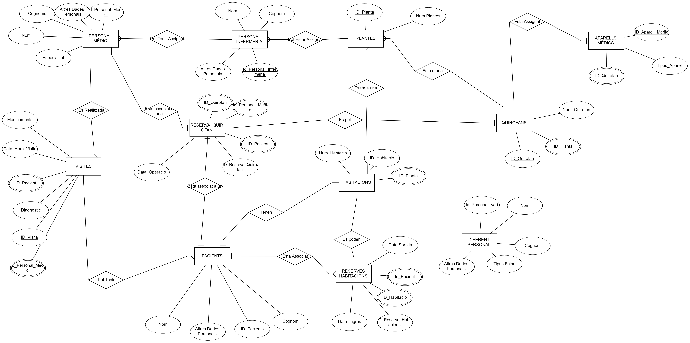

# 
 ANNEX 1 - MODEL ER 

**CLAU PRIMARIA**  *CLAU FORANA*

PERSONAL MÈDIC:  
---------------
**ID Personal Mèdic**, Altres Dades Personals, Nom, Cognom,  Especialitat

 

PERSONAL INFERMERIA:  
--------------------
**ID_Personal_Infermeria**, Nom, Cognom, Altres dades personals

 

VISITES:   
--------
**ID_Visita**, *ID_Personal_Mèdic*, *Id_Pacient*, Diagnostic, Data_Hora_Visita, Medicaments

 

RESERVA_QUIROFAN:  
-----------------
**ID_Reserva_Quirofan**, *ID_Quirofan*, *ID_Personal Medic*, *Id_Pacient*, Data_Operacio

 

PACIENTS:  
---------
**ID_Pacient**, nom, cognom, Altres Dades Personals

 

HABITACIONS:  
------------
**ID_Habitacio**, *id_planta*, *num_habitacio*

 

RESERVES HABITACIONS:  
---------------------
**ID_Reserva_Habitacions**, *ID_Habitacio*, *ID_Pacient*, Data_Ingres, Data_Sortida

 

PLANTES:  
--------
**ID_Planta**, Num_Plantes

 

DIFERENT PERSONAL:  
------------------
**ID_Personal_vari**, nom, cognom, tipus_feina, altres_dades_personals

 

QUIROFANS:  
----------
**ID_quiròfan**, *id_planta*, num_quirofan

 

APARELLS MÈDICS:  
----------------
**Id_aparell_mèdic**, *id_quirofan*, tipus_aparell

 

 

# Readme
#### [Portda](https://github.com/miguelIH/Projecte-Intermodular/blob/main/Portada%20Projecte%20Modular.md)
#### [Annex_2_Connectivitat_i_login](https://github.com/miguelIH/Projecte-Intermodular/tree/main/Annex2/Projecte_Hospital)
#### [Annex_3_Bloc_de_manteniment](https://github.com/miguelIH/Projecte-Intermodular/blob/main/Annex_3_Bloc_de_manteniment.md)
#### [Annex_4_Bloc_de_consultes_i_informess](https://github.com/miguelIH/Projecte-Intermodular/blob/main/Annex_4_Bloc_de_consultes_i_informes.md)
#### [Annex_5_Bloc_de_exportacio_de_dades](https://github.com/miguelIH/Projecte-Intermodular/blob/main/Annex_5_Bloc_de_exportacio_de_dades.md)
#### [Annex_6_API_Seguretat_Social](https://github.com/miguelIH/Projecte-Intermodular/blob/main/Annex_6_API_Seguretat_Social.md)
